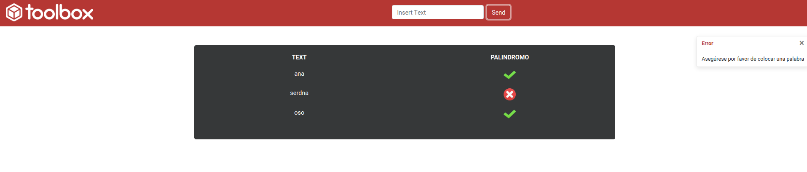

# Toolbox palindrome Frontend-React

This project contains the visual layer of the scope of the exercise here you as a user will be able to send words

## Build Project

`npm install`
## Run Project

`docker-compose up`
## Stop Project

`docker-compose down`

## Processing data

you could run the frontend side in the url `http://localhost:3000/`